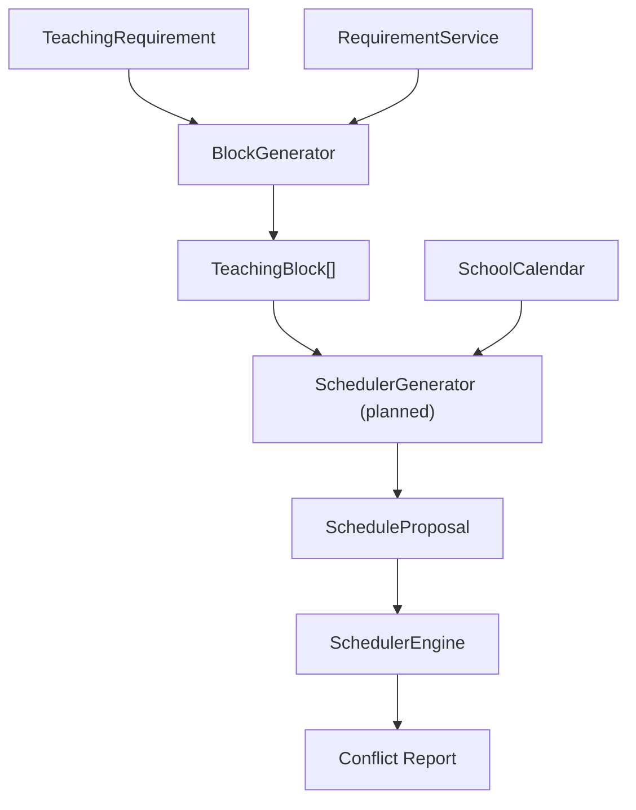

# SchedulerGenerator Algorithm

This document describes the planned `SchedulerGenerator` component. It is a design reference, not implementation code.

## Purpose

`SchedulerGenerator` is the planner that converts candidate `TeachingBlock` distributions into full schedule proposals.

For Phase 1 it produces a single `GenerationResult` containing one `ScheduleProposal` that can be validated by `SchedulerEngine`.

`SearchEngine` sits above the generator and explores multiple candidate orderings. It does not replace the generator; it uses it as a building block to discover several proposals and rank them.

## Inputs

The generator should accept:

- One or more `TeachingBlock` lists generated by `BlockGenerator`.
- A `TeachingRequirement` or a set of requirements describing the teaching obligations.
- A `SchoolCalendar` describing available days, periods and breaks.
- Optional requirement preferences such as preferred rooms and block shapes.
- Existing schedule context if incremental assignment is required.

## Outputs

The generator should produce:

- `ScheduleProposal` objects.
- Each proposal must include a list of `Activity` instances.
- `score` for ranking.
- `conflicts` found during validation.
- `warnings` for soft rule issues.
- `metadata` with provenance and scoring details.

## Planning phases

### Phase 1 — deterministic single-pass placement (implemented)

- Receive a list of `TeachingBlock` instances and a `GenerationContext`.
- Iterate over school days and available `TimeSlot` values.
- Check that the complete duration fits in the available period range.
- Skip blocked slots.
- Skip slots that overlap with already placed activities in the current generation pass.
- Create one `ScheduledActivity` per block when a slot is found.
- Stop after the first successful placement for each block.
- If a block cannot be placed, add a warning and flag the `GenerationResult` as invalid.

### Proposal generation phase (implemented)

- The generator can now build multiple candidate `ScheduleProposal` objects from the same input.
- It varies the placement order of `TeachingBlock` instances to create different valid candidates.
- Supported orderings include the original order, reverse order, longest-first, shortest-first, and a seed-based shuffle.
- The placement strategy remains greedy; only the ordering changes.
- Each proposal is independent and starts with a temporary score of `0`.
- Proposal ranking and scoring remain future work.

This phase is intentionally simple and does not implement optimisation, scoring, backtracking, or proposal ranking.

### Search phase v1 (implemented)

- `SearchEngine` explores a fixed set of placement orderings using `SchedulerGenerator`.
- The search strategy is intentionally simple: original order, reverse order, longest-first, shortest-first, seeded random order, teacher-grouped order, and group-grouped order.
- Each generated proposal is evaluated and scored by `ProposalScorer` and `ConstraintEvaluator`.
- The engine returns an ordered list of proposals, with the highest-ranked proposal marked as `best_proposal`.
- The design remains compatible with future algorithms such as beam search or local search because the search layer is separate from the single-pass generator.

### 2. Block distribution selection

- Receive candidate distributions from `BlockGenerator`.
- Filter or rank distributions based on requirement preferences.
- Decide how many blocks and durations to use for each requirement.

### 2. Temporal placement

- Assign each block to specific school periods using `SchoolCalendar`.
- Translate a block into one or more `Activity` objects with day and start time.
- Ensure periods are lective and not blocked by calendar breaks.

### 3. Conflict-aware assembly

- Build a complete candidate schedule by combining activities across requirements.
- Detect obvious room or teacher collisions during generation.
- Use the current schedule state or partial assignments to avoid conflicts.

### 4. Proposal creation

- Wrap the generated activities into a `ScheduleProposal`.
- Include score, conflicts, warnings and metadata.
- Mark invalid proposals when hard constraints cannot be satisfied.

## Interaction with SchoolCalendar

- `SchoolCalendar` defines available slots per day via `periods_for_day()`.
- `SchedulerGenerator` must only schedule into lective periods.
- Breaks and holidays must be respected during placement.
- The calendar is the temporal model for all activity assignment.

## Interaction with SchedulerEngine

- `SchedulerGenerator` produces proposals, but does not validate them itself.
- Generated proposals should be sent to `SchedulerEngine` for conflict validation.
- The engine returns conflict reports that enrich `ScheduleProposal.conflicts`.
- The generator may use validation feedback to reject or adjust proposals.

## Proposal generation

- Build proposals incrementally from blocks to activities.
- Use heuristics to place activities in a way that minimizes conflicts.
- Preserve teaching requirement constraints while mapping blocks to slots.
- Keep the proposal model separate from API and database layers.

## Ranking

- Rank proposals by `score`.
- Prefer proposals with fewer conflicts and warnings.
- Use scoring penalties to separate good proposals from poor ones.
- Keep tie-breaking conservative: prefer proposals with fewer fragments, better room fit, and more balanced teacher load.

## Future optimisation

- Add search strategies such as backtracking, hill-climbing, or genetic search.
- Cache calendar slot availability and partial assignments.
- Support incremental generation for large schedules.
- Separate scoring from generation so the same proposals can be re-ranked by different strategies.
- Use `ScheduleProposal.metadata` to store optimization traces.

## Mermaid diagram

