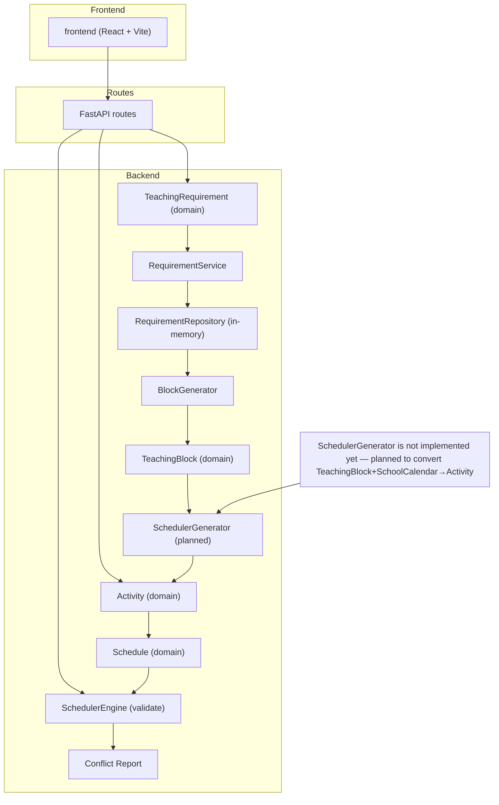

# EMAD-Scheduler — Architecture

This document describes the codebase as it exists now (2026-07-04). It documents the overall architecture, the important domain models, services, data flow, public HTTP API, project folder layout, current status of components and a short next-sprint plan.

## 1. Overall architecture

The project is a single-repository web application split into a Python backend and a small frontend. The backend implements domain models, in-memory persistence for teaching requirements, block generation utilities and a scheduler validation engine. The frontend is a Vite + React single-page UI used for runtime interaction (not covered in depth here).

- Backend: FastAPI application exposing HTTP routes. Implements domain adapters (models), services, repositories, and tests.
- Frontend: Vite + React app under `frontend/` used by the UI. It is independent from the backend code but integrated at runtime.
- Scheduler Engine: A compact, domain-specific engine under `backend/scheduler_engine` responsible for in-memory schedules and conflict validation (room/teacher constraints).
- Domain layer: Plain dataclasses in `backend/scheduler_engine/models` and lightweight adapter re-exports in `backend/models`.
- Services: Business logic and utilities live under `backend/services` (requirement service, block generator, FET importer, etc.).
- Repositories: Simple in-memory repository implementations present in `backend/repositories` (currently `RequirementRepository`).
- Routes: FastAPI route modules in `backend/routes` expose REST endpoints for activities, teachers, scheduler and requirements.

## 2. Important domain models

All domain classes are simple dataclasses. Below are the key models and the fields they expose (as implemented in the codebase).

- TeachingRequirement (`backend/scheduler_engine/models/teaching_requirement.py` / adapter `backend/models/teaching_requirement.py`):
  - id: Optional[str]
  - group_id: str
  - subject_id: str
  - teacher_id: str
  - weekly_hours: float
  - min_days: int
  - max_days: int
  - min_block_duration: float
  - max_consecutive_hours: float
  - allow_half_hour_blocks: bool
  - preferred_distribution: Dict[str,int] (optional)
  - preferred_rooms: List[str] (optional)
  - fixed_teacher: bool
  - priority: int
  - Validation logic runs in `__post_init__` and enforces basic domain invariants (positive weekly hours, sensible min/max days, block durations and priority set {1,2,3}).

- TeachingBlock (`backend/models/teaching_block.py`):
  - id: str (UUID string)
  - duration: float (hours, e.g. 1.0 or 0.5)
  - order: int (position in requirement distribution)
  - preferred_room_id: Optional[str]
  - preferred_teacher_id: Optional[str]
  - fixed: bool
  - metadata: Dict[str, object]

- Activity (`backend/scheduler_engine/models/activity.py`):
  - id: int
  - teacher: str
  - subject: str
  - group: str
  - room: str
  - day: str
  - start: str
  - duration: int

- ScheduledActivity (`backend/scheduler_engine/models/scheduled_activity.py`):
  - teaching_block: TeachingBlock
  - day: int
  - start_timeslot: TimeSlot
  - duration: int
  - room_id: Optional[str]
  - teacher_id: Optional[str]
  - group_id: Optional[str]
  - metadata: Dict[str, Any]
  - Represents a `TeachingBlock` after it has been assigned to a concrete school slot.

- GenerationContext (`backend/scheduler_engine/models/generation_context.py`):
  - school_calendar: SchoolCalendar
  - existing_scheduled_activities: Tuple[ScheduledActivity, ...]
  - fixed_activities: Tuple[ScheduledActivity, ...]
  - blocked_time_slots: Tuple[Tuple[int, int], ...]
  - configuration: Dict[str, Any]
  - random_seed: Optional[int]
  - Immutable after creation and intended as the input contract for future generator work.

- GenerationResult (`backend/scheduler_engine/models/generation_result.py`):
  - generated_scheduled_activities: List[ScheduledActivity]
  - warnings: List[str]
  - statistics: Dict[str, Any]
  - elapsed_time_ms: float
  - proposal_score: Optional[float]
  - valid: bool
  - Captures the output of a generation pass without being a `ScheduleProposal`.

- ScheduleProposal (`backend/scheduler_engine/models/schedule_proposal.py`):
  - id: str
  - activities: List[Activity]
  - score: float
  - conflicts: List[Conflict]
  - warnings: List[str]
  - metadata: Optional[Dict[str, Any]]
  - Represents a complete proposed schedule before acceptance, independent of FastAPI, frontend, and persistence.

- Schedule (`backend/scheduler_engine/models/schedule.py`):
  - lessons: list (mutable container)
  - Methods: `add(lesson)`, `remove(lesson)`, `all()` to iterate stored activities.

- SchoolCalendar (`backend/scheduler_engine/models/school_calendar.py`):
  - days: List[int] (defaults to [0,1,2,3,4])
  - periods_per_day: int (defaults to 12)
  - period_length_minutes: int (defaults to 30)
  - breaks: Dict[int,List[int]]
  - holidays: List[str]
  - Methods: `periods_for_day(day)` returns a list of `TimeSlot`, `is_period_lective(slot)` returns bool.

- TimeSlot (`backend/scheduler_engine/models/timeslot.py`):
  - day: int
  - period: int
  - Immutable dataclass with a string representation `Day {day}, Period {period}`.

## 3. Services and repositories

- RequirementService (`backend/services/requirement_service.py`):
  - Responsible for creating, reading, updating, deleting `TeachingRequirement` domain objects.
  - Normalizes payloads, constructs domain object (validates via the dataclass) and delegates persistence to `RequirementRepository`.
  - Currently includes `generate_blocks(requirement_id)` which retrieves the requirement from the repository and delegates block distribution generation to `BlockGenerator` (returns List[List[TeachingBlock]]).

- RequirementRepository (`backend/repositories/requirement_repository.py`):
  - In-memory store keyed by string id (UUID style). Implements `create`, `get`, `list`, `update`, `delete`.
  - Returns deep copies to avoid accidental mutation of stored objects.

- BlockGenerator (`backend/services/block_generator.py`):
  - Utility that enumerates valid duration partitions (distributions) for a `TeachingRequirement`.
  - Produces lists of `TeachingBlock` instances for each admissible distribution; blocks only carry duration and order (no temporal assignment).
  - Honors `allow_half_hour_blocks`, `min_block_duration`, `max_consecutive_hours`, `min_days`, `max_days` and basic unit multiple checks.

- SchedulerEngine (`backend/scheduler_engine/engine.py`):
  - Lightweight in-memory scheduler engine that stores a `Schedule` and runs constraint validators.
  - Constraints currently include `TeacherConflictConstraint` and `RoomConflictConstraint` under `backend/scheduler_engine/constraints`.
  - Public methods: `load(schedule)`, `move_activity(activity_id, day, start)`, `validate(schedule)` and `get_conflicts()`.

- SchedulerGenerator (`backend/scheduler_engine/generator.py`):
  - Domain-only orchestrator for turning teaching-block inputs into `ScheduledActivity` objects.
  - Responsibilities:
    - receive a `GenerationContext` containing `SchoolCalendar` and scheduling constraints
    - delegate placement decisions to a strategy object
    - produce `GenerationResult` objects from generation passes
    - remain independent from FastAPI, repositories, and persistence layers
    - leave conflict validation to `SchedulerEngine` downstream

- SearchEngine (`backend/scheduler_engine/search_engine.py`):
  - Domain-only orchestrator for exploring multiple candidate schedules.
  - Responsibilities:
    - consume `TeachingRequirement` inputs and build candidate block orderings
    - delegate proposal generation to `SchedulerGenerator`
    - evaluate and score each generated proposal via `ProposalScorer`
    - return a `SearchResult` with the ranked proposals and the best selection
  - Why it is separate from generation:
    - `SchedulerGenerator` is responsible for producing one proposal from one placement order.
    - `SearchEngine` is responsible for exploring several orders and choosing among the resulting candidates.
    - This separation keeps the generation algorithm simple and makes future optimisation strategies replaceable without changing the generator itself.
  - Inputs: `GenerationContext` containing the calendar, existing/fixed activities, blocked slots, configuration, and optional seed.
  - Outputs: `GenerationResult` containing generated scheduled activities, warnings, statistics, elapsed time, optional proposal score, and validity.
  - Invariants:
    - it never validates conflicts directly
    - it never accesses repositories, databases, or HTTP layers
    - it does not implement the placement algorithm itself; it delegates that decision to a strategy
  - Relationship to other components:
    - consumes teaching-block concepts from the earlier block-generation stage
    - uses `SchoolCalendar` as the temporal availability source
    - produces `ScheduledActivity` values that can later be assembled into a `ScheduleProposal`
    - leaves validation to `SchedulerEngine` downstream

- PlacementStrategy (`backend/scheduler_engine/placement_strategy.py`):
  - Abstract interface for deciding where a single `TeachingBlock` should be placed.
  - Input: `TeachingBlock`, `GenerationContext`, and the current `ScheduledActivity` list.
  - Output: either a `ScheduledActivity` or `None` when no placement is possible.
  - This abstraction allows future strategies such as `RandomPlacementStrategy`, `BalancedPlacementStrategy`, or `CompactPlacementStrategy` without changing `SchedulerGenerator`.

- GreedyPlacementStrategy (`backend/scheduler_engine/placement_strategy.py`):
  - Concrete implementation that preserves the current behaviour: first valid day, first valid slot, no optimisation, no scoring.

- ScheduleProposal (`backend/scheduler_engine/models/schedule_proposal.py`):
  - Represents a candidate timetable before acceptance.
  - Contains `id`, `activities`, `score`, `conflicts`, `warnings`, and optional `metadata`.
  - Independent of FastAPI, frontend, and persistence.

- SearchResult (`backend/scheduler_engine/models/search_result.py`):
  - Represents the output of a search pass.
  - Contains `best_proposal`, `proposals`, `explored_states`, `elapsed_time_ms`, and `statistics`.
  - Used by `SearchEngine` to expose the ranked search outcome.

Note: `SchedulerGenerator` (temporal assignment that consumes TeachingBlocks and SchoolCalendar to produce `Activity` instances) is not implemented in this codebase — it is planned for a future sprint.

## 4. Data flow (actual implemented pipeline and planned steps)

The project documents and tests expect the following pipeline (this section reflects the repository state and planned components):

TeachingRequirement
        ↓
RequirementService
        ↓
RequirementRepository
        ↓
BlockGenerator
        ↓
TeachingBlock
        ↓
SchedulerGenerator (planned)
        ↓
Activity
        ↓
Schedule
        ↓
SchedulerEngine
        ↓
Conflict Report

Status notes on each step above:
- TeachingRequirement: implemented (dataclass + validations).
- RequirementService: implemented (CRUD + `generate_blocks` helper that invokes `BlockGenerator`).
- RequirementRepository: implemented (in-memory store).
- BlockGenerator: implemented and exercised by tests (generates candidate `TeachingBlock` lists). Some tests highlight algorithm coverage but the implementation exists as-is.
- TeachingBlock: implemented (simple dataclass domain object).
- SchedulerGenerator: planned — NOT implemented. There is no component that consumes `TeachingBlock` and a `SchoolCalendar` to produce scheduled `Activity` instances in the repository.
- Activity: implemented (dataclass) — used by `SchedulerEngine` and route adapters.
- Schedule: implemented (in-memory container).
- SchedulerEngine: implemented — used to load schedules and run constraint validations; it does not assign temporal slots from `TeachingBlock` distributions.

## 5. HTTP API endpoints (current)

The backend exposes the following routes (FastAPI modules under `backend/routes`):

- Requirements (router: `backend/routes/requirements.py`)
  - GET `/requirements` — list all stored `TeachingRequirement` objects.
  - POST `/requirements` — create a new `TeachingRequirement` from JSON payload.
  - PATCH `/requirements/{requirement_id}` — partial update of an existing requirement.
  - DELETE `/requirements/{requirement_id}` — delete requirement.

- Activities (router: `backend/routes/activities.py`)
  - GET `/activities` — returns activities for a teacher (query param `teacher_id` required).
  - PATCH `/activities/{activity_id}` — patch an activity (calls the service `update_activity`).

- Teachers (router: `backend/routes/teachers.py`)
  - GET `/teachers` — returns list of teachers via `services.teacher_service.get_all_teachers()`.

- Scheduler (validation & runtime API — routers: `backend/routes/scheduler.py` and `backend/routes/scheduler_live.py`)
  - POST `/scheduler/validate` — validate a list of activities (uses `SchedulerEngine.validate`).
  - POST `/scheduler/load` — load an in-memory schedule into the global engine instance (via `engine.load`). Accepts a list of activities (adapter converts to engine `Activity`).
  - POST `/scheduler/load-fet` — convenience endpoint that imports activities from the bundled FET file and loads them into the engine.
  - GET `/scheduler/state` — returns the current engine state (activities + conflicts).
  - POST `/scheduler/move` — request to move an activity (calls `engine.move_activity`) with MoveDTO payload.

Notes:
- The requirements endpoints operate on the in-memory `RequirementRepository`. The service and repository classes are exercised in unit tests under `backend/tests`.
- The scheduler routes use `scheduler_engine.engine_instance.engine` (a global `SchedulerEngine` instance) for runtime state management.

## 6. Project folder structure (top-level)

The repository root contains (abridged):

- EMAD_2627_.fet
- README.md
- backend/
  - main.py (FastAPI app entrypoint)
  - database.py (SQLAlchemy DB wiring used by activities)
  - fet_reader.py, import_fet.py, import_teachers.py (FET import utilities)
  - init_db.py
  - package.json, requirements.txt
  - docs/
  - models/ (adapter re-exports and small domain models)
  - repositories/ (in-memory `RequirementRepository`)
  - routes/ (FastAPI route modules: activities.py, teachers.py, scheduler.py, scheduler_live.py, requirements.py)
  - scheduler_engine/ (self-contained scheduler engine used for validation)
    - engine.py, engine_instance.py, state.py, validator.py
    - constraints/ (teacher_conflict.py, room_conflict.py, base.py)
    - models/ (activity.py, conflict.py, schedule.py, timeslot.py)
  - schemas/ (pydantic DTOs)
  - services/ (requirement_service.py, block_generator.py, fet_importer.py, activity_service.py, teacher_service.py)
  - tests/ (unit tests for requirements, generator and scheduler engine constraints)
- frontend/
  - index.html, package.json, README.md, vite.config.js
  - src/ (React sources, components and utilities)

See the repository tree in the workspace for the complete file listing (tests, docs and small utilities not exhaustively enumerated above).

## 7. Mermaid architecture diagram

## 8. Current Status

- Implemented
  - TeachingRequirement (domain dataclass, validation)
  - TeachingBlock (domain dataclass)
  - Activity, Schedule, SchoolCalendar, TimeSlot (scheduler models)
  - RequirementRepository (in-memory CRUD)
  - RequirementService (CRUD + `generate_blocks` helper)
  - BlockGenerator (enumerates candidate block distributions and returns `TeachingBlock` lists)
  - SchedulerEngine (in-memory schedule storage and constraint validation)
  - FastAPI routes: requirements, activities, teachers, scheduler, scheduler_live
  - Tests for repository, service and block generator exist under `backend/tests` (note: some tests currently exercise the generator outputs)

- In progress / Observed
  - Block generation algorithm implemented and tested; tests indicate the generator produces many distributions (the implementation exists as-is). Some test vectors in `backend/tests/test_block_generator.py` assert a specific ordering and sets of distributions; the codebase contains the generator implementation currently under test.

- Planned
  - SchedulerGenerator: a component that will take `TeachingBlock` lists plus a `SchoolCalendar` and produce one or more candidate `Activity` lists (temporal assignments). This is explicitly NOT implemented.
  - Integration of temporal assignment into the `SchedulerEngine` pipeline: the current engine remains strictly for validation and state management.

## 9. Next Sprint

Objective: Implement `SchedulerGenerator` without replacing `SchedulerEngine`.

- Deliverables:
  - A `SchedulerGenerator` component that consumes `TeachingBlock` (and optionally requirement preferences + `SchoolCalendar`) and produces one or more candidate `Activity` lists (temporal assignments).
  - Integration points: `RequirementService` (or a new orchestrator) will call `BlockGenerator` → `SchedulerGenerator` to create `Activity` instances; these `Activity` instances are then loaded into `SchedulerEngine` for validation.
  - Preserve current `SchedulerEngine` responsibilities: it must continue to act solely as validator and in-memory state holder; do not reimplement validation logic inside the generator.

- Constraints and notes:
  - Keep `TeachingBlock` domain-only: the generator should enrich blocks with temporal information only when producing `Activity` instances.
  - Avoid heavy refactors: integrate `SchedulerGenerator` as an additional service layer component to be exercised by new routes or service-level methods.

---

Files changed in this documentation sprint
- Created: `docs/ARCHITECTURE.md`

Summary of this document
- A concise snapshot of the repository as of 2026-07-04 describing implemented components (domain models, repository, services, block generator and scheduler engine), available API endpoints, the canonical data flow from `TeachingRequirement` to conflict reports, a Mermaid diagram and the status of planned work (notably `SchedulerGenerator`).

No source code or tests were modified by this documentation update.